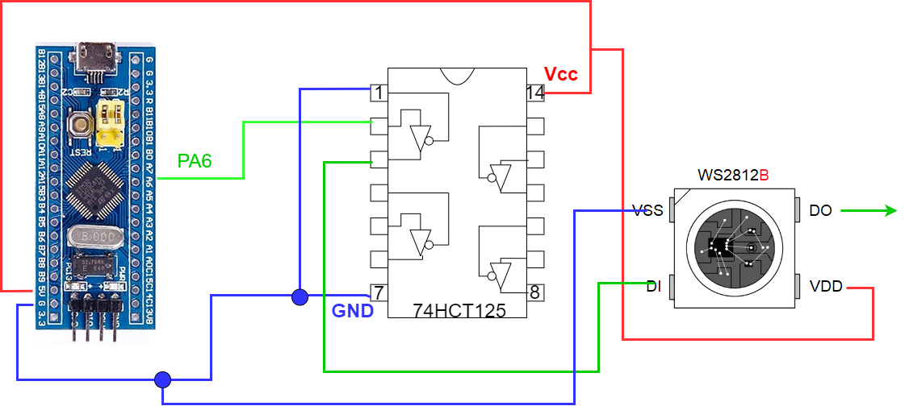

# WS2812B and STM32F103C8 very simple project

STM32F103C8 use TIM3 for generate serial data for 8 diodes WS2812B
For save memory DMA use 48 bytes length circular buffer
for copy data to TIM3.
DMA provide interrupts in case of half buffer length and on the end.
This interrupts are used for refresh circular buffer LED data 
from array which provides color for every one LED.
This array needs 3 bytes for one WS2812 LED only.
Earlier project ws2812b_stm32f103c8t6_simple needs 24 bytes for one LED.

This project was implemented using projects:
https://forbot.pl/blog/kurs-stm32l4-diody-rgb-ws2812b-liczniki-quiz-id49890
https://msalamon.pl/adresowalne-diody-ws2812b-na-stm32-cz-1/

Additionaly added possibinlity of steering LED chain via USB commands.
After connect circuit presen to PC it presents like virtual COM port.
Using putty or other terminal soft is possible to 
provide commands like below:
help   - shows short help text
 ?     - shows short help text
on     - turn on led on blue pill board
off    - turn off led on blue pill board
toggle - toggle led on blue pill board

led <LED number> <color>
       - set color of particular LED in chain
         for example 
            led 3 #FF0000
          - led 3 red color brightness max
         for example 
            led 5 0 255 0
          - led 5 green color brightness max

effect - switch - turn on/off random effect
turn off - turn off all LED's

